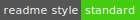

# Tech_Daily_App Readme

[]()[](https://www.apache.org/licenses/LICENSE-2.0)[](https://github.com/RichardLitt/standard-readme)

> -   **Platform**: This project should be able to run on both Linux and Windows platform. But due to differences between Windows and Linux, if you want to develop or run this program on your own machine, you should change somewhere.
> -   **License**: #TODO
> -   **readme style**: this readme uses standard readme style.

This program consists of three main parts, backend, frontend, and web crawler. In a way, this program seems to be three independent programs. Therefore, we copied three pieces of README and you can find the same README in three repositories. But special files such as api.md and different contributing files are different in three parts.

#TODO

## Table of Contents

- [Background](#background)
- [Install](#install)
- [Usage](#usage)
- [API](#api)
- [Contributing](#contributing)
- [License](#license)

## Background

#TODO

## Install

To install this program on your machine, first you should download all code, then begin your installation.

For more details, see the [install.md](./install.md)

## Usage

### 1. backend usage

To run backend, you should ensure all your configuration has been well-prepared, then you can use

```shell
python manage.py
```

then you will see the tips:

```shell
Type 'manage.py help <subcommand>' for help on a specific subcommand.

Available subcommands:

[auth]
    changepassword
    createsuperuser

[contenttypes]
    remove_stale_contenttypes
    
[django]
    check
    compilemessages
    createcachetable
    dbshell
    diffsettings
    dumpdata
    flush
    inspectdb
    loaddata
    makemessages
    makemigrations
    migrate
    sendtestemail
    shell
    showmigrations
    sqlflush
    sqlmigrate
    sqlsequencereset
    squashmigrations
    startapp
    startproject
    test
    testserver

[sessions]
    clearsessions

[staticfiles]
    collectstatic
    findstatic
    runserver
```

Normally, to start server, you can type:

```shell
python manage.py runserver
```

### 2. frontend usage

#### Build Setup

``` bash
# install dependencies
npm install
# serve with hot reload at localhost:8080
npm run dev
# build for production with minification
npm run build
# build for production and view the bundle analyzer report
npm run build --report
# add android platform:
cordova platform add android
# build the project(apk):
cordova build android
```

### 3. web crawler usage

Web crawler consists of four steps,

-   url crawler
-   html crawler
-   html parser
-   html converter

after these four steps, information will be stored into your database. For each step’s usage, you can run Main.java with parameters below.

```bash
java Main.java urlcrawler/htmlcrawler/htmlparser/htmlcnoverter
```

## API

See [api.md](api.md) in backend part!

## Contributing

See different [contributing files](./Contributing.md) in three parts.

## License

[MIT © Tech Daily Group.](../LICENSE)
